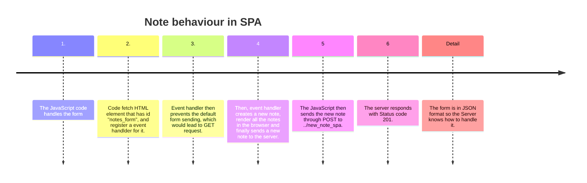

```mermaid
timeline
    title Note behaviour in SPA
    1. : The JavaScript code handles the form
    2. : Code fetch HTML element that has id "notes_form", and register a event handlder for it.
    3. : Event handler then prevents the default form sending, which would lead to GET request.
    4 : Then, event handler creates a new note, render all the notes in the browser and finally sends a new note to the server.
    5 : The JavaScript then sends the new note through POST to ../new_note_spa. 
    6 : The server responds with Status code 201.
    Detail : The form is in JSON format so the Server knows how to handle it.  
```
